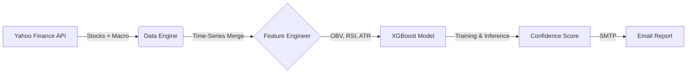

# PSX-Oracle V2.1 🇵🇰


> **"Emerging Markets require Macro signals."**

**PSX-Oracle** is an automated, production-grade stock prediction pipeline designed specifically for the Pakistan Stock Exchange (PSX). Unlike standard autoregressive models that fail in volatile emerging markets, PSX-Oracle injects **Macro-Economic Liquidity Shocks** (Crude Oil Prices, USD/PKR Devaluation) directly into the gradient boosting logic.

---

##  Key Features

*   **Macro-Enhanced Engine**: Ingests `CL=F` (Oil) and `PKR=X` (Currency) to predict Energy and Banking sector moves.
*   **Smart Money Detection**: Uses **On-Balance Volume (OBV)** to identify institutional accumulation before price spikes.
*   **XGBoost Core**: Optimized Gradient Boosting Classifier with TimeSeriesSplit validation to prevent look-ahead bias.
*   **Zero-Cost Automation**: Runs entirely on **GitHub Actions** (Free Tier).
*   **Professional Reporting**: Delivers a daily HTML equity research brief to your inbox.

---

##  Architecture



##  Installation & Usage

1.  **Clone the Repository**
    ```bash
    git clone https://github.com/your-username/psx-oracle.git
    cd psx-oracle
    ```

2.  **Install Dependencies**
    ```bash
    pip install -r requirements.txt
    ```

3.  **Run Locally**
    ```bash
    python main.py
    ```

##  Automation Setup

This project is designed to run on **GitHub Actions**.

1.  Fork this repo.
2.  Go to **Settings > Secrets and variables > Actions**.
3.  Add the following secrets:
    *   `EMAIL_USER`: Your Gmail address.
    *   `EMAIL_PASS`: Your Gmail App Password.

The workflow defined in `.github/workflows/daily_forecast.yml` will automatically run every day at **5:00 PM PKT**.

---

##  Disclaimer

**This software is for educational purposes only.** It uses statistical probability to forecast market movements and does not constitute financial advice. The authors are not responsible for any financial losses incurred.
